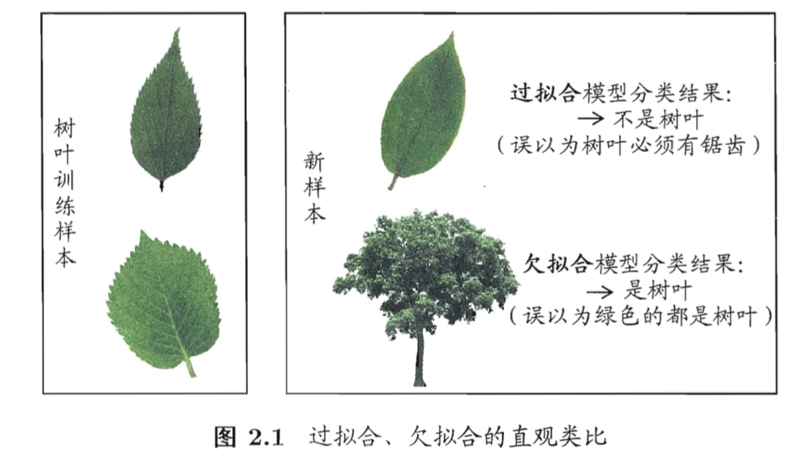
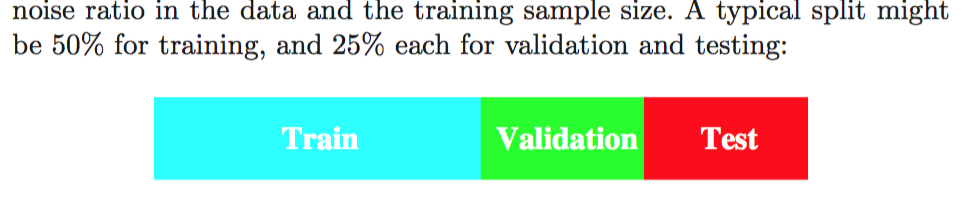
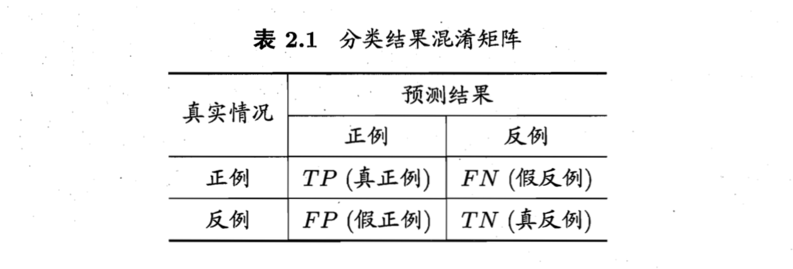
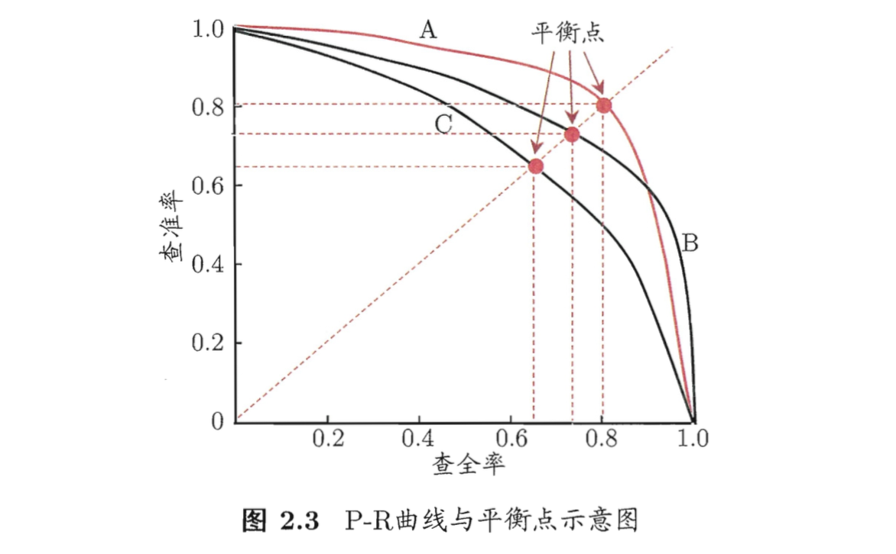
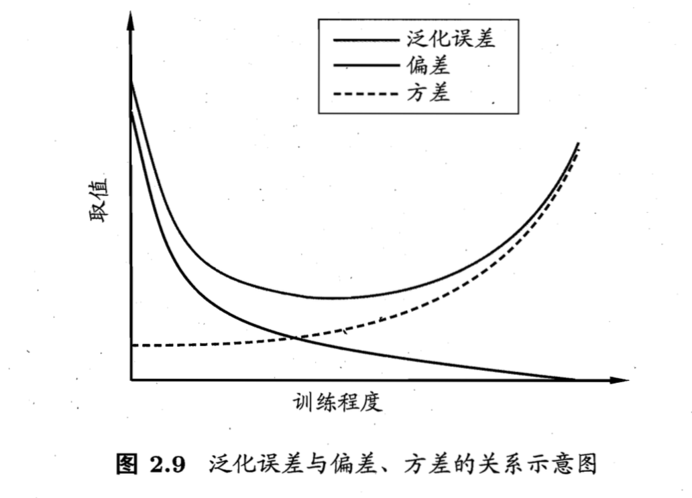

[TOC]

### 过拟合和欠拟合
当学习器把训练样本学的“太好”时，可能把训练样本自身的一些特点当作所有潜在样本的一般性质，这样会导致泛化性能下降。这种现象在机器学习中称为“过拟合(overfitting)”。与过拟合相对的是“欠拟合(underfitting)”，指对训练样本的一般性质尚未学好。
过拟合是机器学习面临的主要障碍。然而过拟合是无法彻底避免的。

### 评估方法
在现实任务中，需要把数据集分为训练集和测试集，以测试集上的误差作为泛化误差的近似。方法有：

- 留出法(hold out)：2/3 - 4/5 样本训练
- 交叉验证法(cross validation)：特例留一法LOOCV
- 自助法(bootstrap)
   
自助法能将约 $lim_{m\to\infty}(1-\frac{1}{m})^m \to \frac{1}{e} \approx 0.368$的样本留在采样数据集之外，因此我们可将采样数据集作为训练集，剩余部分作测试集。
自助法的特点：
1. 在数据集较小，难以划分训练/测试集时有用
2. 产生多个不同的训练集，有利于集成学习
3. 产生的数据集改变了数据的初始分布，引入了估计偏差。

在数据量足够时，留出法和交叉验证法更常用。

数据集理想的的划分图：

当根据验证集上的性能来完成模型选择和调参(超参数)之后，需要用整个数据集重新训练模型。
###性能度量
衡量模型泛化能力的评价标准。

####回归任务
#####均方误差
Mean Squared Error, MSE
$$E(f;D)=\frac{1}{m} \sum_{i=1}^m (f(\textbf x_i)-y_i)^2$$
or
$$E(f;D)=\int_{\textbf x \sim D}(f(\textbf x)-y)^2 p(\textbf x)d\textbf x$$

*可添加其他的指标，并探讨不同的指标有何影响*

####分类任务
#####错误率和精度
$$E(f;D)=\frac{1}{m} \sum_{i=1}^m I(f(\textbf x_i) \neq y_i)$$
$$acc(f;D)=\frac{1}{m} \sum_{i=1}^m I(f(\textbf x_i) = y_i)=1-E(f;D)$$
or
$$E(f;D)=\int_{\textbf x \sim D}(I(f(\textbf x_i) \neq y_i) p(\textbf x)d\textbf x$$
$$acc(f;D)=\int_{\textbf x \sim D}(I(f(\textbf x_i) = y_i) p(\textbf x)d\textbf x=1-E(f;D)$$
#####查准率，查全率与F1

注意这些指标(TP,TN,FP,FN)中的P/N均指预测值，表格的每一列预测值相同，每一行真实值相同。

查准率(Precision)：$P=\frac{TP}{TP+FP}$

查全率(Recall)：$R=\frac{TP}{TP+FN}$

*直观的解释*：查准率是指所有预测为正例的样本中真正为正例的比例，查全率是指所有真正为正例的样本中被成功预测为正例的比例。二者是从“预测为正”和“真正为正”的不同角度出发，分别对正例的统计。

查全率和查准率是一对矛盾的度量。一般来说，只将有较大把握的预测为正时查准率高而查全率低，将较小把握的也预测为正时查准率低而查全率高。

以下的统计图形的绘制方式基本为：
**根据学习器的预测结果对样例排序，学习器认为正例概率较高的在前，较低的在后。逐个把每个样本作为正例进行预测。**

P-R曲线
在此过程中每次可以计算出当前的查全率，查准率，作图即可得到查全率(横轴)-查准率(纵轴)曲线。示例图：

现实中的P-R曲线常是非单调的，不平滑的，在很多局部有上下波动。
根据P-R曲线对学习器的比较：

1. 若曲线A完全“包住”曲线B，则A性能优于B。
2. 若无法按1简单比较，则可比较平衡点(BEP, Break-Event Point, 查全率=查准率的点)坐标的大小。

BEP还是过于简化，更常用的是F1度量:
$$\frac{1}{F1}=\frac{1}{2}(\frac{1}{P}+\frac{1}{R})=>
F1 = \frac{2 \times PR}{P+R}=\frac{2TP}{样例总数+TP-TN}$$
当对查准率与查全率重视程度不同(如商品推荐场景和逃犯检索场景的对比)时，可采用$F1$的一般度量形式$F_{\beta}$:
$$frac{1}{F_{\beta}}=\frac{1}{1+\beta^2}(\frac{1}{P}+\frac{\beta^2}{R}) => F1 = \frac{2 \times P \times R}{P+R}$$

对多个二分类混淆矩阵的处理方法：

- 宏F1：先计算各个矩阵的P，R，然后做平均，计算总的F1
- 微F1：先计算TP，TN，FP，FN的平均值，再计算对应的P，R，F1

#####ROC和AUC
ROC曲线绘制的过程：与P-R曲线的绘制方法相同，但纵轴是“真正例率(TPR)”，横轴是“假正例率(FPR)”
$$TPR = \frac{TP}{TP+FN}$$
$$FPR = \frac{FP}{TN+FP}$$ 
(分母为分子+分子的完全反项)
ROC图中，对角线对应“随机猜测”模型，点(0，1)对应将所有正例排在所有反例之前的“理想模型”，点(1，0)对应将所有反例排在所有正例之前的最差模型。

**对角线对应“随机猜测”模型的解释**：当完全采用随机猜测的策略时，样本的排列是完全随机的。也就是说，可以期望样本从前到后的分布是一致的，正例和反例都均匀散开。这样，从前到后每做出一个正例预测，该预测为TP的概率为$\frac{N_p}{N_p+N_N}$, 为FP的概率为
$\frac{N_N}{N_p+N_N}$。这样，无论在哪一步，都有$\frac{E(TP)}{E(FP)}=\frac{N_p}{N_N}$，即始终有$TPR=FPR$.

**AUC**: ROC曲线下的面积。
 当知道了ROC曲线上各点的坐标后，就可以根据公式计算AUC。
 AUC考虑的是样本预测的排序质量，与排序误差有紧密关系。给定$m^+$个正例和$m^—$个反例，令$D^+$和$D^—$分别表示正，反例集合，则排序损失定义为：
 $$l_{rank}=\frac{1}{m^+m^-}\sum_{\textbf x^+ \in D^+}\sum_{\textbf x^- \in D^-}(I(f(\textbf x^+) < f(\textbf x^-)) + \frac{1}{2}I(f(\textbf x^+) = f(\textbf x^-)))$$
容易看出，$l_{rank}$对应的是ROC曲线之上的面积，即
$$AUC=1-l_{rank}$$
#####代价敏感错误率和代价曲线
非均等代价：为FP和FN设定不同的代价。这样总的代价敏感错误率为：
$$E(f;D;cost)=\frac{1}{m}(\sum_{\textbf x_i \in D^+}I(f(\textbf x_i)\neq y_i) \times cost_{01} + \sum_{\textbf x_i \in D^-}I(f(\textbf x_i)\neq y_i) \times cost_{10})$$
非均等代价下，ROC曲线不能直接反映出学习器的期望总体代价，而“代价曲线”可以。
###比较检验
假设统计检验为我们进行学习器性能比较提供了重要依据。
####假设检验
- 二项检验
- t检验

####交叉验证t检验
- k折交叉验证
- 5*2交叉验证

####McNemar检验 
对两分类器性能相同的检验

以上均为对两个分类器(算法)的比较检验

####Friedman， Nemenyi检验
对多个算法的比较检验

###偏差和方差
偏差-方差分解是解释学习算法泛化性能的一种工具。

对测试样本$\textbf x$, 令$y_D$为$\textbf x$在数据集中的标记，$y$为$\textbf x$的真实标记，$f(\textbf x;D)$为训练集$D$上学得模型$f$在$\textbf x$上的预测输出，$\overline{f}(\textbf x)=E_D[f(\textbf x;D)]$为学习算法的期望预测。

令

- $var(\textbf x)=E_D[(f(\textbf x;D)-\overline{f}(\textbf x))^2]$为使用样本数不同的训练集产生的方差；
- $\varepsilon^2=E_D[(y_D-y)^2]$为噪声；
- ${bias}^2(\textbf x)=(\overline{f}(\textbf x)-y)^2$为偏差(期望输出与真实标记的差别)。

假定噪声期望为0，即$E_D[y_D-y]=0$, 以回归任务为例，可对算法的期望泛化误差进行分解：
$$
\begin{equation}
\begin{split}
E(f;D)=&E_D[(f(\textbf x; D)-y_D)^2]\\\\ 
=&E_D[(f(\textbf x; D)-\overline{f}(\textbf x)+\overline{f}(\textbf x)-y_D)^2]\\\\ 
=&E_D[(f(\textbf x; D)-\overline{f}(\textbf x))^2]+E_D((\overline{f}(\textbf x)-y_D)^2]+E_D[2(f(\textbf x; D)-\overline{f}(\textbf x))(\overline{f}(\textbf x)-y_D)]\\\\
=&E_D[(f(\textbf x; D)-\overline{f}(\textbf x))^2]+E_D((\overline{f}(\textbf x)-y_D)^2]\\\\
=&E_D[(f(\textbf x; D)-\overline{f}(\textbf x))^2]+E_D((\overline{f}(\textbf x)-y+y-y_D)^2]\\\\
=&E_D[(f(\textbf x; D)-\overline{f}(\textbf x))^2]+E_D((\overline{f}(\textbf x)-y)^2]+E_D[(y-y_D)^2]+2E_D[(\overline{f}(\textbf x)-y)(y-y_D)]\\\\
=&E_D[(f(\textbf x; D)-\overline{f}(\textbf x))^2]+(\overline{f}(\textbf x)-y)^2+E_D[(y-y_D)^2]\\\\
=&(\overline{f}(\textbf x)-y)^2+E_D[(f(\textbf x; D)-\overline{f}(\textbf x))^2]+E_D[(y-y_D)^2]\\\\
=&{bias}^2(\textbf x)+var(\textbf x)+\varepsilon^2
\end{split}
\end{equation}
$$

也就是说，泛化误差可分解为偏差，方差和噪声之和。

为取得较好的泛化性能，需要使偏差，方差都较小。一般来说，偏差和方差是有冲突的，称为“偏差-方差窘境(bias-variance dilemma)”:

- 训练不足时，学习器的拟合能力不够强，偏差主导了泛化错误率；
- 训练加深时，训练数据的扰动渐渐能被学习器学到，方差逐渐主导了泛化错误率。若训练数据自身的，非全局性的特性被学习到了，将会发生过拟合。

###剩余问题
回归的性能度量应该不止MSE，探讨一下当使用其他度量(如MAE)时对学习算法的影响。

A. Metrics: [Abhishek's blog](http://blog.kaggle.com/2016/07/21/approaching-almost-any-machine-learning-problem-abhishek-thakur/)中提到了一些其他的分类Metrics，如

-  Binary: ROC AUC or simply AUC
-  Multi-label or multi-class: categorical cross-entropy or multiclass log loss

B. 对Outlier的影响：有的对异常点鲁棒性较强，有的较弱

C. 如何从概率分布的角度对Metrics进行解释?