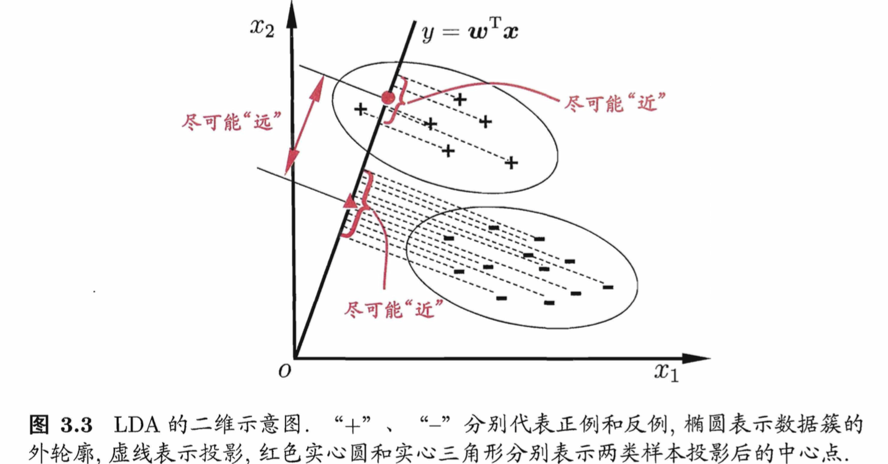

[TOC]

### 线性判别分析
#### 基本思路
LDA的思想非常朴素:给定训练样例集, 设法将样例投影到一条直线上, 使得同类样例的投影点尽可能接近、异类样例的投影点尽可能远离;在对新样本进行分类时,将其投影到同样的这条直线上,再根据投影点的位置来确定新样本的类别。

LDA的推导细节和多分类的推广情况可见于PRAML或周书。

#### 贝叶斯角度
值得一提的是,LDA可从贝叶斯决策理论的角度来阐释,并可证明,当两类数据同先验、满足高斯分布且协方差相等时,LDA可达到最优分类.

多元高斯分布定义为：
$$f(x)=\frac{1}{(2\pi)^{p/2}|\Sigma|^{1/2}} exp \left(-\frac{1}{2}(x-u)^T \Sigma^{-1}(x-u)\right)$$

LDA分类器假设第$k$类观测服从一个多元高斯分布$P(X|C_k)=N(u_k, \Sigma)$。贝叶斯分类器将观测$X=x$分到后验概率最大的一类。由后验概率的表达式
$$P(C_k|X) = \frac {P(X|C_k)P(C_k)} {\sum_{k=1}^{m} P(X|C_k)P(C_k)}$$
可知将其归入
$$\delta_k(x)=x^T \Sigma^{-1} u_k - \frac{1}{2} u_k^T \Sigma^{-1} u_k + log \pi_k$$
最大的一类即可。

这样，贝叶斯决策边界满足$\delta_k(x)=\delta_t(x)$, 即
$$x^T \Sigma^{-1} u_k - \frac{1}{2} u_k^T \Sigma^{-1} u_k = x^T \Sigma^{-1} u_t - \frac{1}{2} u_t^T \Sigma^{-1} u_t$$
因而是线性的。

#### 训练方法
可用Maximum Likelyhood方法来训练LDA的参数。如对二分类情况：
设$P(C_1)=\pi, P(C_2)=1 - \pi$
For $n=1, \cdots, N$。令$t_n=1$ when $X \in C_1$, $t_n=0$ when $X \in C_2$。
$$P(\boldsymbol t | \pi, u_1, u_2, \Sigma) = \prod_{n=1}^N [\pi N(x_n|u_1, \Sigma)]^{t_n} [(1 - \pi) N(x_n|u_2, \Sigma)]^{1-t_n}$$
使$logP(\boldsymbol t | \pi, u_1, u_2, \Sigma)$最大，即可求解出$u_1, u_2, \pi, \Sigma$。
#### LDA作为降维方法
若将W视为一个投影矩阵,则多分类LDA将样本投影到N-1维空间, N-1通常远小于数据原有的属性数. 于是,可通过这个投影来减小样本点的维数, 且投影过程中使用了类别信息. 因此LDA也常被视为一种经典的监督降维技术.

### 二次判别分析
假设各高斯分布的协方差矩阵不相等，得到的结果为QDA，边界为非线性的。

### Logistic, LDA, QDA的使用场景比较
1. ISLR Section 4.5
2. ESL Section 4.4.5。LDA假定数据满足Guassian Mixture Model, 因此：
	- 所有的数据都会影响对Guassian分布参数的训练（与SVM对比）；
	- 对Outlier比较敏感