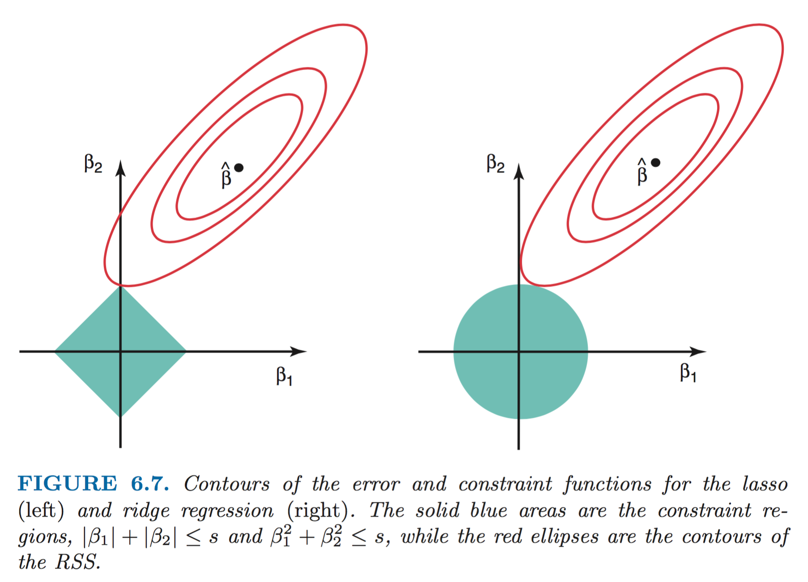

[TOC]

### 总论
#### 使用Regularization方法的原因（以后可添加）
- 通过减小模型的方差，提高测试准确率
- 自动化的进行变量或特征选择

#### 方法
- 子集选择
- 正则化
- 降维法

### 子集选择
#### 最优子集选择
Best subset selection

1. Let $M_0$ denote the null model, which contains no predictors. This
model simply predicts the sample mean for each observation.
2. For $k=1,2,...p$:
	- Fit all ${p \choose k}$ models that contain exactly $k$ predictors.
	- Pick the best among these ${p \choose k}$ models, and call it $M_k$. Here best is defined as having the smallest $RSS$, or equivalently largest $R^2$.
3. Select a single best model from among $M_0, \cdots, M_p$ by using cross-validated prediction error, or 
 	- $C_p (AIC)$
 	- $BIC$
 	- Adjusted $R_2$.

*特点*

简单直接但计算效率不高，$O(2^p)$的复杂度使得$p$较大时不具备计算可行性。

#### 逐步选择
向前和向后的逐步选择方法

- 向前：从空模型开始，每次在上一个最佳模型的基础上增加一个预测变量
- 向后：从包含所有变量的模型开始，每次在上一个最佳模型的基础上减去一个预测变量

向前选择可用于$p>>n$的情况，而向后选择不可，因为在预测变量的个数为$p$时不存在唯一解。向前选择当$p \ge n$时结果也不唯一。

#### 选择最优模型
每次挑选包含$k$个预测变量的最佳模型时，可依据的指标有交叉验证测试误差或以下指标：

$$
\begin{split}
C_p&=\frac{1}{n}(RSS+2d\hat\sigma^2)\\\\
AIC&=\frac{1}{n\hat\sigma^2}(RSS+2d\hat\sigma^2)\\\\
BIC&=\frac{1}{n}(RSS+log(n)d\hat\sigma^2)\\\\
Adjust~R^2&=1-\frac{RSS/(n-d-1)}{TSS/(n-1)}
\end{split}
$$
其中$d$为预测变量的个数，$\hat\sigma^2$ is an estimate of the variance of the error $\epsilon$ associated with each response measurement in 
$$Y=\beta_0+\beta_1 X_1 + \cdots + \beta_p X_p + \epsilon$$

#### 交叉验证的问题
交叉验证估计测试误差方法的特点：

- 适用范围更广，即使很难确定模型自由度，或难以估计$\sigma^2$，仍然可以使用。
- 过去，当p或n很大时，交叉验证在计算上不可行，但如今此问题已不存在。
- If we repeated the validation set approach using a different split of the data into a training set and a validation set, or if we repeated cross-validation using a different set of cross-validation folds, then the precise model with the lowest estimated test error would surely change. In this setting, we can select a model using the **one-standard-error rule**:
	- We first calculate the standard error of the estimated test MSE for each model size 
	- Then select the smallest model for which the estimated test error is within one standard error of the lowest point on the curve. 
	- The rationale here is that if a set of models appear to be more or less equally good, then we might as well choose the simplest model

### Shrinkage Methods
#### Ridge Regression
$$\hat \beta^{ridge}=\mathop{\arg\min}\limits_{\beta}\{\sum_{i=1}^n(y_i-\beta_0-\sum_{j=1}^p x_{ij}\beta_j)^2 + \lambda \sum_{j=1}^p \beta_j^2 \}$$
Or
$$\hat \beta^{ridge}=\mathop{\arg\min}\limits_{\beta}\sum_{i=1}^n(y_i-\beta_0-\sum_{j=1}^p x_{ij}\beta_j)^2, \\\\
subject~to \sum_{j=1}^p \beta_j^2 \leq t$$

#####使用Ridge需要注意的地方

- 常数项$\beta_0$无需惩罚。若$X$的各列已经进行中心化（均值0），则$\hat{\beta_0}=\overline y=\frac{1}{n} \sum_{i=1}^n y_i$
- 简单线性回归是尺度不变的, 但Ridge会受到尺度的影响。因此使用Ridge前最好先对其进行标准化$\overline x_{ij}=\frac{x_{ij}}{\sigma_j}$(相信这条对Lasso也适用)。

#####Ridge Regression的求解
we assume that this centering has been done, so that the input matrix $X$ has $p$ (rather than $p + 1$) columns.

Writing the criterion in matrix form,
$$RSS(\lambda) = (y − X\beta)^T (y − X\beta) + \lambda \beta^T \beta$$
the ridge regression solutions are easily seen to be
$$\beta_{ridge} = (X^T X + \lambda I)^{−1}X^T y$$

与简单线性回归类似，也存在满秩/不满秩的状况。

##### Ridge的缺点
所有系数都会向0的方向衰减，但除非$\lambda=\infty$，否则任何系数都不会被压缩到0，因此无法选择预测变量的子集。

为克服上述缺点，我们可以使用
#### Lasso Regression
$$\hat \beta^{ridge}=\mathop{\arg\min}\limits_{\beta}\{\sum_{i=1}^n(y_i-\beta_0-\sum_{j=1}^p x_{ij}\beta_j)^2 + \lambda \sum_{j=1}^p |\beta_j| \}$$

在lasso中，当$\lambda$足够大时，l1惩罚项可强制将某些系数设定为0。所以说lasso得到了稀疏模型。

lasso和ridge都可以看作是存在限制条件下的优化问题。

##### 对Lasso可以将系数压缩至0的解释：

##### Lasso的求解方法
$l1-norm$的导数是连续但不光滑的，所以不能直接求导利用梯度下降来求解。根据[知乎](https://www.zhihu.com/question/22332436)上的总结，可用的求解办法有以下几种：

1. 贪心算法，每次先找跟目标最相关的feature，然后固定其他的系数，优化这一个feature的系数，具体的求导也要用到subgradient。代表算法有LARS，feature-sign search等。
2. 逐一优化。就每次固定其他的dimension，选择一个dimension进行优化。因为只有一个方向有变化，所以都可以转化为简单的subgradient问题。最后反复迭代所有的dimension，达到收敛。代表算法有 coordinate descent，block coordinate descent等。
3. 还有一类算法，就是proximal及其扩展方法。这类算法可以解决一系列的sparse norm优化问题，基本思想就是不断的迭代需要优化的稀疏。每一次迭代上上一次优化结果的邻域找一个新的点，而且新的点需要在优化目标的限定区域内。这个限定区域可以通过找到原始优化问题的对偶问题得到。

##### Ridge和Lasso的贝叶斯解释
$$p(\beta|X, Y ) \varpropto f(Y |X, \beta)p(\beta|X) = f(Y |X, \beta)p(\beta)$$

- Ridge: 对应$p(\beta)$为Guassian的情况（各维度无相关性，所以每个$\beta_i$也符合一维Guassian分布$g(\beta_i)$），回归结果为后验分布均值
- Lasso：对应$p(\beta)$为Laplace的情况，回归结果不为后验分布均值（这是因为Ridge的后验还是Guassian，所以mean = MAP，而Lasso则并非如此）
- 从先验分布的角度解读：由于Laplace分布在0处存在尖峰，而Guassian在0处平坦，因此Lasso倾向于得到一个许多系数为0的分布，而Ridge假设系数关于0随机分布。

这两种回归中的$\lambda$一般使用CV来选择。貌似一般备选值为log的等差值，如$[0.001, 0.01, 0.1, 1, 10, 100, 1000]$。