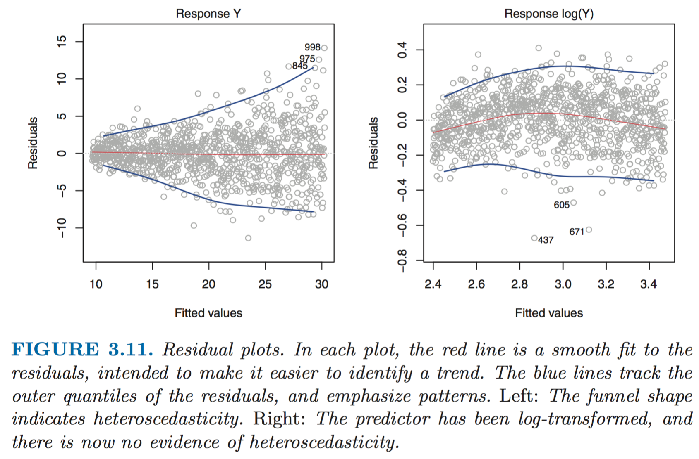
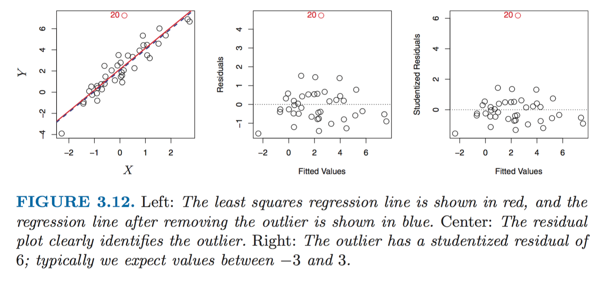
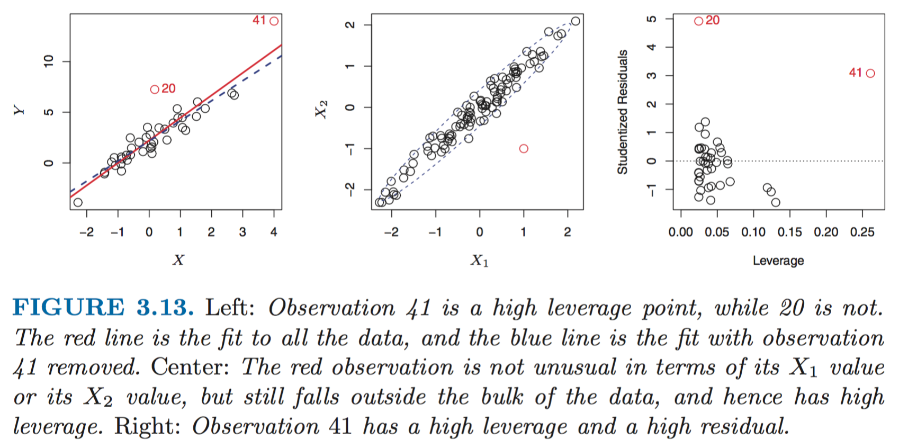
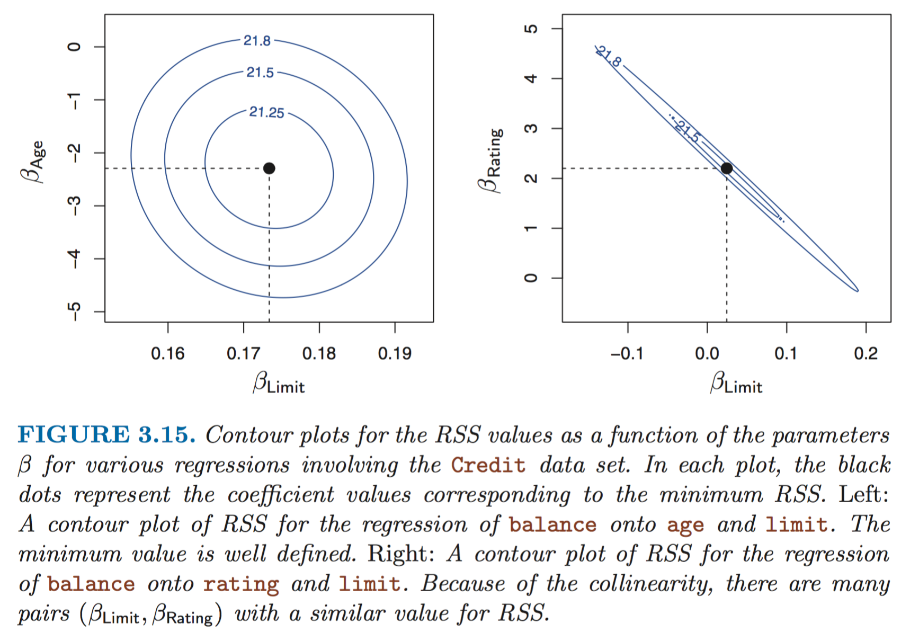

[TOC]

Many fancy statistical learning approaches can be seen as gener- alizations or extensions of linear regression.

## 简单线性回归
### 评价系数估值的准确性

#### RSS(Residual sum of squares)
$$RSS = \sum_{i=1}^{n}e_i^2 = \sum_{i=1}^{n}(y_i-\hat{y_i})^2$$   
#### 置信区间(confidence interval)
如对于单变量的线性回归，$\beta_1$的95%置信区间约为：
$$\hat\beta_1 \pm 2 \times SE(\hat\beta_1)$$
就是说该区间内有约95%的可能性包含$\beta_1$的真实值。
#### 假设检验-t统计量
对单变量回归$y=\beta_1 x + \beta_0$, 可通过计算关于0的t统计量, 检验$\beta_1=0$(X与Y不相关)的假设：
$$t=\frac{\hat\beta_1-0}{SE(\hat\beta_1)}$$
假设$\beta_1=0$, 则t符合自由度为n-2的t分布，可计算
#### $p$值
- 任意观测值大于等于$|t|$的概率
- we interpret the p-value as follows: a small p-value indicates that it is unlikely to observe such a substantial association between the predictor and the response due to chance, in the absence of any real association between the predictor and the response. 
- Typical p-value cutoffs for rejecting the null hypothesis are 5% or 1%.
- 所以如果$p$值足够小，我们就拒绝0假设。

### 评估模型准确性
#### RSE
$$RSE = \sqrt{\frac{1}{n-p-1}RSS} = \sqrt{\frac{1}{n-p-1}\sum_{i=1}^{n}(y_i-\hat{y_i})^2}$$   
The RSE is considered a measure of the lack of fit of the model to the data. 

#### $R^2$统计量
RSE是以Y的单位衡量的，所以并不清楚构成良好RSE的要素有哪些。$R^2$采取比例形式
$$
TSS = \sum(y_i-\bar y)^2\\\\
R^2 = \frac{TSS-RSS}{TSS} = 1 - \frac{RSS}{TSS}
$$

- TSS可被认为是响应变量中的固有变异性，RSS则是回归后仍无法解释(消除)的变异性。
- TSS−RSS measures the amount of variability in the response that is explained (or removed) by performing the regression, and $R^2$ measures the proportion of variability in Y that can be explained using X. 
- An $R^2$ statistic that is close to 1 indicates that a large proportion of the variability in the response has been explained by the regression.
- The $R^2$ statistic has an interpretational advantage over the RSE, since unlike the RSE, it always lies between 0 and 1. 

#### 相关性
$$r=\rho_{X,Y}=\frac{cov(X,Y)}{\sigma_{X}\sigma_{Y}}=\frac{E((X-\mu_{X})(Y-\mu_{Y}))}{\sigma_{X}\sigma_{Y}}=\frac{E(XY)-E(X)E(Y)}{{\sqrt{E(X^{2})-E^{2}(X)}}{\sqrt{E(Y^{2})-E^{2}(Y)}}}$$

在简单线性模型中有$R^2=r^2$, 但在多元线性回归中则不然。
## 多元线性回归
多元回归引入的一个问题是，由于相关性的影响，一些实际上并不是结果变量原因的变量会被认为是“原因”
### F统计量
  判定响应变量$Y$和预测变量$X_1, X_2, ..., X_P$之间是否有关系
  
  通过假设检验. 0假设$H_0: \beta_i=0, i=1,...,p$。备择假设$H_{\alpha}$：至少有一个$\beta_j不为0$
	  
  计算
  $$F=\frac{(TSS-RSS)/p}{RSS/(n-p-1)}$$
  若$H_0$为真，则F接近1. 若F值极大，则认为响应和预测变量之间存在关联。
  
  如果想检测部分的预测变量子集，可以尝试分别计算这些子集的F值。
  
  当$p>n$时，不能使用这种方法。
  
  **为何不能单纯的看每个预测变量的p值**：
  
  p值很小时，表明“不存在关联”是一种小概率事件。但是，当无关预测变量的个数很大时，这种小概率事件终将发生，在无关的预测变量中必然会出现几个较小的p值。
  
### 特征选择(feature selection)

  p值仍然是一个主要参考，特别是预测变量个数较小时。

  为确定一个重要的预测变量子集的维数$p'$, 可以使用一些统计指标帮助判定：
  
  - AIC
  - BIC
  - Adjusted $R^2$
  
  确定维数之后，还需要选择特定的子集，可以使用
  
  - 向前选择
  - 向后选择
  - 混合选择

### $R^2$和$RSE$作为模型的判定指标

  多元线性回归中，$R^2=Corr(Y, \hat Y)^2$. 若$R^2$接近1，表明模型可以解释响应变量的大部分方差。
  
  $R^2$统计量的问题：
  
  当更多的变量进入模型时，即使新加入的预测变量和响应变量之间的关联很弱，$R^2$也一定会增加。这是因为在最小二乘方程中添加变量必然能使我们更好的拟合训练数据。这时可以尝试使用RSE。
  
## 线性模型扩展
### 去除可加性假设
预测变量相互无影响 => 增加交互项

实验分层原则：

如果模型中含有交互项(如$X_1X_2$)，那么即使主效应($X_1, X_2$)的系数的p值不显著，也应包含在模型中。

### 去除线性假设
预测变量线性相加 => 多项式回归

按：这两种方法都比较难以确定使用的时机。

## 潜在的问题
前三项各自对线性模型的前提提出了挑战，后三项为实践中的问题。
### 非线性的响应-预测关系
相关变量：

- y轴：残差$e_i=y_i-\hat{y_i}$
- x轴：预测值$y_i$

使用**残差图**(残差-预测值关系), 查看是否存在明显的规律。如果结果为无明显规律的均匀分布，则说明线性模型可以实现较好的拟合；否则，则有可能说明了数据的非线性。

如果残差图表明存在非线性关系，一种简单的办法是在模型中使用预测变量的非线性变换，如$logX, \sqrt{X}和X^2$。

### 误差项自相关
线性模型的一个重要假设是误差项$\varepsilon_1,~\varepsilon_2,\cdots,~\varepsilon_n$不相关，但真实情况往往并非如此。

如果是时间序列数据，可以绘制时间序列上的残差图，观察有无明显规律。

*按*：如果不是讨论$\varepsilon$, 而是讨论$y$的话，似乎也可以使用pandas的[时间序列分析图](http://pandas.pydata.org/pandas-docs/stable/visualization.html#lag-plot)(Lag, autocorrelation)来帮助分析。

### 误差项方差非恒定
仍然可使用残差图观测。如果残差图呈漏斗形，说明误差项方差非恒定，可能需要用凹函数对y做变换。

### 离群点

学生化残差(studentized residual)有助于发现离群点。但离群点也可能并不是因为失误导致的，而是暗示模型存在缺陷。

按：这里是先有模型，再按模型去判定outlier，所以会有“模型存在缺陷”的说法。可能更好的outlier detection方法是在建模之前就判定？
### 高杠杆点

作者的定义：

- 离群点指的是对给定的$x_i$来说，$y_i$异常的点
- 高杠杆(high leverage)点表示$x_i$是异常的，即此点落在了数据主题之外。

按：感觉二者都可以被归入广义上的outlier

可以使用杠杆统计量来量化的判定高杠杆点。杠杆统计量的取值总是在1/n和1之间，且所有观测的平均杠杆值等于(p+1)/n。因此，如果一个点的杠杆统计量大大超出了(p+1)/n，那么我们可能怀疑该点有较高的杠杆作用。

### 共线性

共线性(colinearity)指两个或更多的预测变量高度(线性)相关。

共线性可能导致的问题：

- 使得共线的变量的标准差大大增加
- 减小了假设检验正确的检验出非零系数的概率。

检测共线性的方法：

- 相关系数矩阵：如有三个或更多变量存在共线性，则此办法失效。
- 方差膨胀因子(variance inflation factor, VIF)：可用于判定多重共线性(multicolinearity)。
- 经验法则：VIF超过5或10就表明有共线性问题。
$$VIF(\hat\beta_j)=\frac{1}{1-R_{X_j|X_{-j}}^2}$$
where $R_{X_j|X_{-j}}^2$ is the $R^2$ from a regression of $X_j$ onto all of the other predictors. If $R_{X_j|X_{-j}}^2$ is close to one, then collinearity is present, and so the VIF will be large.

解决方案：

- 剔除一个问题变量
- 将共线变量组合成一个单一的预测变量

## 线性模型与KNN的比较
KNN会更大的受到curse of dimensionality的影响。