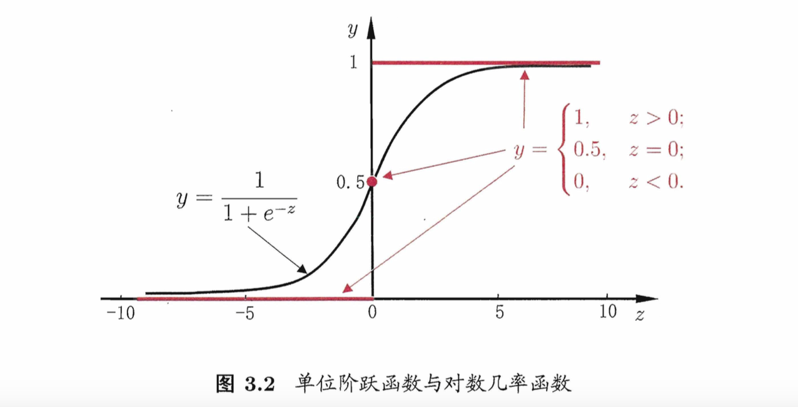

[TOC]
###线性回归无法直接用于分类的原因
- 对于定性的响应变量，不能简单地用1，2，3等来指代每一类label，因为这强行附加了一种并不存在的定量关系，因此建立的线性模型可能是多变的(不同的编码方式)和不可靠的。
- 线性回归的预测值会落到[0,1]之外，无法被用来当做概率解释数据。

###对数几率回归
回归任务 => 分类任务
####基本思路
分类任务的输出标记为$y\in\{0, 1\}$, 而线性回归的预测值$z={\boldsymbol{\omega}}^T\boldsymbol x+b$为实数，因此我们需将实值$z$转换为0/1值.最理想的是“单位阶跃函数”(unit-step function)
$$y=
\begin{equation}
\begin{cases}
0,& z<0\\\\
0.5,& z=0\\\\
1,& z>0
\end{cases}
\end{equation}
$$
即若预测值$z$大于零就判为正例,小于零则判为反例,预测值为临界值零则可任意判别。

单位阶跃函数不连续,因此不能直接用作广义线性模型中的$g^{-1}$。实际单调可微的为对数几率函数(logistic function):
$$
\begin{equation}
y=\frac{1}{1+e^{-z}}=\frac{1}{1+e^{-({\boldsymbol{\omega}}^T\boldsymbol x+b)}}   \end{equation}
$$
该式可变化为
$$
\begin{equation}
ln\frac{y}{1-y}={\boldsymbol{\omega}}^T\boldsymbol x+b
\end{equation}
$$
$y$和$1-y$分别为样本$\boldsymbol x$作为正例和反例的可能性。二者的比值$\frac{y}{1-y}$称为“几率(odds)”, 反映了$\boldsymbol x$作为正例的相对可能性。对几率取对数则得到“对数几率”(log odds,亦称logit)
$$ln\frac{y}{1-y}$$
由此可看出,式(2)实际上是在用线性回归模型的预测结果去逼近真实标记的对数几率，因此,其对应的模型称为“对数几率回归”(logistic regression,亦称logit regression).特别需注意到,虽然它的名字是“回归”,但实际却是一种分类学习方法。
####学习方法
将式(2)中的y视为类后验概率估计$p(y=1|\boldsymbol x)$,则式(3)可重写为
$$
ln\frac{p(y=1|\boldsymbol x)}{p(y=0|\boldsymbol x)}={\boldsymbol{\omega}}^T\boldsymbol x+b
$$
为便于讨论,令$\beta=(\boldsymbol{\omega};b), \boldsymbol{\hat{x}}=(\boldsymbol x;1)$,则${\boldsymbol{\omega}}^T\boldsymbol x+b$可简写为$\boldsymbol{{\beta}^T\hat{x}}$. 这样有
$$
p(y=1|\boldsymbol {\hat x}; \boldsymbol{\beta})=\frac{e^{\boldsymbol{{\beta}^T{\hat{x}}}}}{1+e^{\boldsymbol{{\beta}^T{\hat x}}}}\\\\
p(y=0|\boldsymbol {\hat x}; \boldsymbol{\beta})=\frac{1}{1+e^{\boldsymbol{{\beta}^T{\hat x}}}}
$$
对数似然为
$$
\begin{split}
l(\boldsymbol \beta) &= 
\sum_{i=1}^{m}lnp(y_i|\boldsymbol{\hat x_i};\boldsymbol{\beta})\\\\ &= 
\sum_{i=1}^{m}y_i lnp(y_i=1|\boldsymbol {\hat x_i}; \boldsymbol{\beta}) + (1-y_i)lnp(y_i=0|\boldsymbol {\hat x_i}; \boldsymbol{\beta})\\\\ &= 
\sum_{i=1}^{m}y_i (\boldsymbol{{\beta}^T{\hat x_i}}-ln(1+e^{\boldsymbol{{\beta}^T{\hat x_i}}})) - (1-y_i)ln(1+e^{\boldsymbol{{\beta}^T{\hat x_i}}})\\\\ &= 
\sum_{i=1}^{m}(y_i \boldsymbol{{\beta}^T{\hat x_i}} - ln(1+e^{\boldsymbol{{\beta}^T{\hat x_i}}}))
\end{split}
$$
这样，$-l(\boldsymbol \beta)$就是一个关于$\boldsymbol \beta$的高阶可导连续凸函数，用经典的数值优化算法如梯度下降法(gradient descent method)、牛顿法(Newton method)等都可求得其最优解,于是就得到
$${\boldsymbol \beta}^*=\mathop{\arg\min}\limits_{\boldsymbol \beta}l(\boldsymbol \beta)$$

#### 求解方法示例
一般运用Newton–Raphson法对逻辑回归问题进行求解，如Iterative reweighted least squares方法。主要运用的公式为：
$$\beta^{new} = \beta^{old} - \left(\frac{{\partial}^2 l(\beta)}{\partial \beta\partial \beta^T}\right)^{-1}
\frac{\partial l(\beta)}{\partial \beta}$$
其中
$$
\begin{split}
\frac{\partial l(\beta)}{\partial \beta}&=\sum_{i=1}^{m} \boldsymbol{\hat x_i} (y_i - p_1(\boldsymbol{\hat x_i} ; \boldsymbol{\beta}))\\\\
\frac{{\partial}^2 l(\beta)}{\partial \beta\partial \beta^T}&=-\sum_{i=1}^{m} \boldsymbol{\hat x_i} \boldsymbol{\hat x_i}^T p_1(\boldsymbol{\hat x_i} ; \boldsymbol{\beta}) (y_i - p_1(\boldsymbol{\hat x_i} ; \boldsymbol{\beta}))
\end{split}
$$

#### Regularized
L1 : See in ESL 4.4.4
