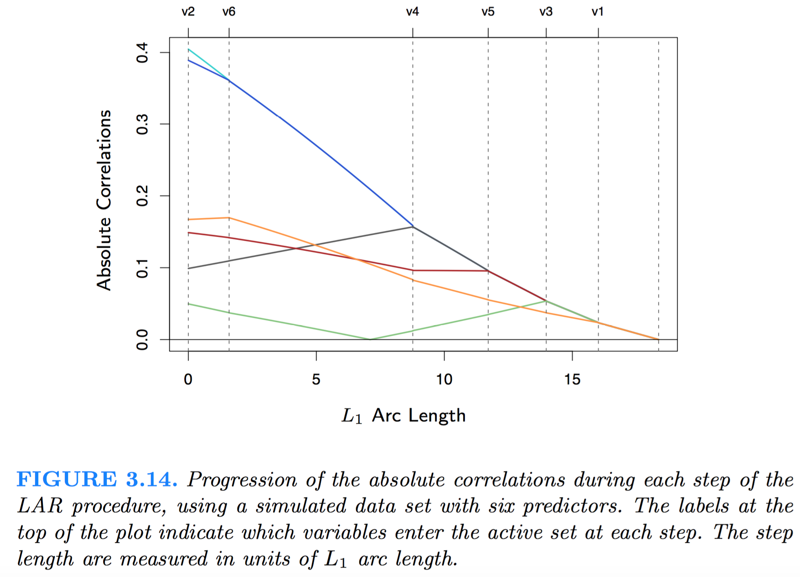

[TOC]

### Description
- At the first step it identifies the variable most correlated with the response. 
- Rather than fit this variable completely, LAR moves the coefficient of this variable continuously toward its least-squares value (causing its correlation with the evolving residual to decrease in absolute value). 
- As soon as another variable “catches up” in terms of correlation with the residual, the process is paused. 
- The second variable then joins the active set, and their coefficients are moved together in a way that keeps their correlations tied and decreasing. 
- This process is continued until all the variables are in the model, and ends at the full least-squares fit. 

###Algorithm
1. Standardize the predictors to have mean zero and unit norm. Start with the residual $\boldsymbol r=\boldsymbol y−\boldsymbol{\overline y},\beta_1,\beta_2,\cdots,\beta_p =0$.
2. Find the predictor $\boldsymbol x_j$ most correlated with $\boldsymbol r$.
3. Move $\beta_j$ from 0 towards its least-squares coefficient $⟨\boldsymbol x_j ,\boldsymbol r⟩$, until some other competitor $\boldsymbol x_k$ has as much correlation with the current residual as does $\boldsymbol x_j$.
4. Move $\beta_j$ and $\beta_k$ in the direction defined by their joint least squares coefficient of the current residual on $(\boldsymbol x_j,\boldsymbol x_k)$, until some other competitor $\boldsymbol x_l$ has as much correlation with the current residual.
5. Continue in this way until all $p$ predictors have been entered. After $min(N − 1, p)$ steps, we arrive at the full least-squares solution.

Suppose $A_k$ is the active set of variables at the beginning of the kth step, and let $\beta_{A_k}$ be the coefficient vector for these variables at this step; there will be $k − 1$ nonzero values, and the one just entered will be zero.

The name “least angle” arises from a geometrical interpretation of this process; In each step the new fit direction $u_k$ makes the smallest (and equal) angle with each of the predictors in $A_k$.

### Advantage and Disadvantage
The advantages of LARS are:

- It is numerically efficient in contexts where p >> n (i.e., when the number of dimensions is significantly greater than the number of points)
- It is computationally just as fast as forward selection and has the same order of complexity as an ordinary least squares.
- It produces a full piecewise linear solution path, which is useful in cross-validation or similar attempts to tune the model.
- If two variables are almost equally correlated with the response, then their coefficients should increase at approximately the same rate. The algorithm thus behaves as intuition would expect, and also is more stable.
- It is easily modified to produce solutions for other estimators, like the Lasso.

The disadvantages of the LARS method include:

Because LARS is based upon an iterative refitting of the residuals, it would appear to be especially sensitive to the effects of noise. This problem is discussed in detail by Weisberg in the discussion section of the Efron et al. (2004) Annals of Statistics article.

### 其他
LAR似乎主要用于对Lasso Linear/Logistic Regression的求解。