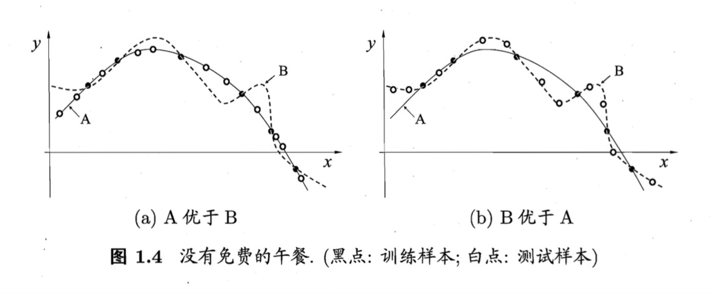

[TOC]

机器学习所研究的主要内容，是关于在计算机上从数据中产生“模型”的算法，即学习算法（learning algorithm），它可以基于数据产生模型，再用模型预测新的数据。

### 术语集合
data set, instance, sample, attribute, feature, feature vector, dimensionality, learning/training, traing set, test set, hypothesis, model/learner, prediction/test, label

### 大致分类
（可在以后找个更完整版来替换） 

1. 监督学习(supervised learning)
   - 分类
   - 回归
2. 无监督学习(unsupervised learning)
   - 聚类

### 版本空间与归纳偏好
机器学习的目标是得到具有较好泛化(generalization)能力的模型。通常会假设样本是独立同分布的。

我们可以把学习过程看成一个在所有假设(hypothesis)组成的空间中进行搜索的过程，搜索目标是找到与训练集匹配(fit)的假设。可能有多个假设与训练集一致，我们称之为“版本空间”。

当版本空间中存在多个与训练集一致的假设时，机器学习算法必须存在对某种类型假设的偏好，称为“归纳偏好(inductive bias)”。如“奥卡姆剃刀”就是一种归纳偏好。

算法的归纳偏好是否与问题本身匹配，大多数时候直接决定了算法能否取得好的性能。

### NFL定理
NFL定理例图：

NFL定理：**所有“问题”出现的机会相同，或所有问题同等重要（或：假设空间里的 $f$ 均匀分布）**，则总的期望性能与算法无关。

在实际情形中，我们只关注自己正在试图解决的问题，而并不关心我们的结果算法在其他问题上是否为好的方案。所以，NFL定理的寓意在于让我们认识到，脱离具体问题空谈“什么学习算法更好”毫无意义，因为如果考虑所有潜在问题，则所有算法都一样好。**学习的关键还是要是算法的归纳偏好与问题相匹配**。